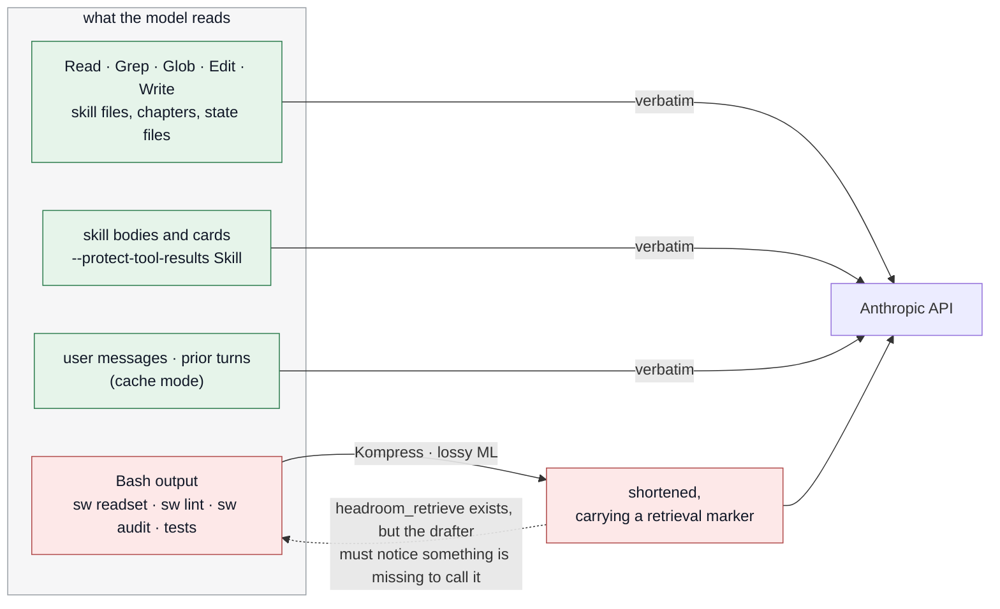

# Contributing

The operating contract is [CLAUDE.md](CLAUDE.md) and the orientation for a working session is
[AGENTS.md](AGENTS.md), including the three commands to run **before you commit a change to the
toolkit**. This file holds what neither covers: optional local tooling for the person editing the
toolkit, and what it does to the toolkit's own guarantees.

---

## Optional: token compression with Headroom

[Headroom](https://github.com/headroomlabs-ai/headroom) (Apache-2.0) is a local proxy that sits
between Claude Code and the Anthropic API and compresses what the model reads before it is sent.
It is **optional and entirely outside the toolkit**: nothing in `.claude/` or `scripts/` knows it
exists, `sw.py` stays stdlib-only, and a clone without it behaves exactly as documented.

Verified on 2026-09-12 with headroom-ai 0.37.0, Claude Code 2.1.269 (VS Code extension), a
subscription login, Linux. **Read [what it does to this repo](#what-it-does-to-this-repo) before
turning it on** — the savings here come from compressing exactly the thing the read-set is made
of.

### 1. Install

```bash
pipx install "headroom-ai[proxy]"      # or: uv tool install "headroom-ai[proxy]"
```

`[proxy]` runs the text compressor on ONNX. `[all]` pulls in PyTorch and is not needed.

### 2. Run the proxy as a login service (Linux)

```bash
mkdir -p ~/.config/systemd/user
cat > ~/.config/systemd/user/headroom-proxy.service <<'EOF'
[Unit]
Description=Headroom context-compression proxy for Claude Code (127.0.0.1:8787)
After=network-online.target

[Service]
Environment=HEADROOM_BEACON=off
ExecStart=%h/.local/bin/headroom proxy --host 127.0.0.1 --port 8787 --mode cache \
  --no-rate-limit --no-telemetry --protect-tool-results Skill
Restart=on-failure
RestartSec=5

[Install]
WantedBy=default.target
EOF
systemctl --user daemon-reload
systemctl --user enable --now headroom-proxy
curl -s http://127.0.0.1:8787/livez     # "healthy" before you go on
```

No `sudo` anywhere — it is a user unit.

### 3. Route Claude Code through it

Only once `/livez` answers, because a missing proxy means Claude Code cannot connect at all:

```bash
python3 - <<'EOF'
import json, pathlib
p = pathlib.Path.home() / ".claude/settings.json"
s = json.loads(p.read_text())
s.setdefault("env", {}).update({
    "ANTHROPIC_BASE_URL": "http://127.0.0.1:8787",
    "ENABLE_TOOL_SEARCH": "true",
})
p.write_text(json.dumps(s, indent=2) + "\n")
EOF
```

Reload the editor window, or start a new session. Savings show at
`http://127.0.0.1:8787/dashboard`.

**Why those settings, and not the defaults:**

| setting | why |
|---|---|
| `--mode cache` | freezes prior turns so the provider prompt cache keeps hitting. Headroom's `token` mode — its legacy name is `token_headroom` — rewrites earlier turns for more compression and busts the cache, which on a subscription usually costs more than it saves |
| `--no-rate-limit` | the built-in default is 60 req/min and 100k tok/min; one long turn exceeds it and gets a 429 from the proxy rather than from Anthropic |
| `--protect-tool-results Skill` | skill instructions are never lossy-compressed. `Read`, `Grep`, `Glob`, `Write`, `Edit`, `WebFetch` and `WebSearch` results already are protected, by Headroom's own defaults |
| `HEADROOM_BEACON=off`, `--no-telemetry` | the anonymous usage beacon is on by default (it reports metrics, not prompts or paths) |
| `ENABLE_TOOL_SEARCH=true` | behind a custom base URL Claude Code otherwise stops deferring tool schemas and loads every one into context |

**macOS and Windows** — untested here. `headroom install apply` writes the launchd agent or
scheduled task and the same two settings keys, and `headroom install remove` reverts both. Its
service takes no `--no-rate-limit`, so raise the limits through the environment instead:

```bash
headroom install apply --scope provider --providers manual --target claude --mode cache \
  --protect-tool-results Skill --env HEADROOM_BEACON=off \
  --env HEADROOM_RPM=100000 --env HEADROOM_TPM=100000000
```

### What it does to this repo

| what the model reads | compressed? |
|---|---|
| `Read` / `Grep` / `Glob` / `Edit` / `Write` results — skill files, chapters, state files opened directly | never |
| skill bodies and cards | never, with `--protect-tool-results Skill` |
| user messages, and prior turns in cache mode | never |
| **`Bash` output — `sw readset`, `sw lint`, `sw audit`, test runs** | **yes**, through Kompress, which is lossy ML compression |



The one red path is the one the toolkit leans on hardest. Everything the drafter opens by hand is
protected; the single bounded call that was built to replace opening things by hand is not.

Four consequences, in the order they will bite:

1. **The read-set can arrive shortened.** `sw readset` is the whole bounded read-set and it
   reaches the model as Bash output — the one channel Headroom compresses. A compressed block
   carries a retrieval marker and the proxy offers the model a `headroom_retrieve` tool for the
   original, but the drafter has to notice something is missing to call it, and the toolkit's
   first hard rule tells it *not* to open the source files for anything the read-set contains. To
   keep it verbatim, add `Bash` to `--protect-tool-results` — which gives up most of what Headroom
   saves in this repo. That trade is the whole decision.
2. **Benchmark numbers stop being comparable.** `sw trace` reads usage out of the transcripts, and
   a routed session's usage is what was sent *after* compression. Runs #1–#4 in
   [docs/benchmark.md](docs/benchmark.md) were unrouted. Bypass the proxy for a benchmark run, or
   record in the run notes that it was routed.
3. **Remote Control disappears.** Claude Code 2.1.196+ hides `/rc` whenever the base URL is not
   `api.anthropic.com`, and Headroom cannot restore it. The 1M context window also needs the
   `[1m]` model suffix behind a custom base URL.
4. **A stopped proxy stops Claude Code.** `systemctl --user status headroom-proxy` first when a
   session cannot reach the API.

Expect modest savings on this workload: Headroom claims ~20% for coding agents (the 60–95% figure
is for JSON payloads), and a single-prompt check here saved 2.4% of the message plus ~16k tokens
of tool schema.

### Bypass it for this repo only

Add to `.claude/settings.local.json` — per-machine, gitignored, and higher precedence than the
user settings:

```json
{ "env": { "ANTHROPIC_BASE_URL": "https://api.anthropic.com" } }
```

### Undo everything

```bash
systemctl --user disable --now headroom-proxy
rm ~/.config/systemd/user/headroom-proxy.service
systemctl --user daemon-reload
pipx uninstall headroom-ai
```

Then remove `ANTHROPIC_BASE_URL` and `ENABLE_TOOL_SEARCH` from the `env` block of
`~/.claude/settings.json`.
