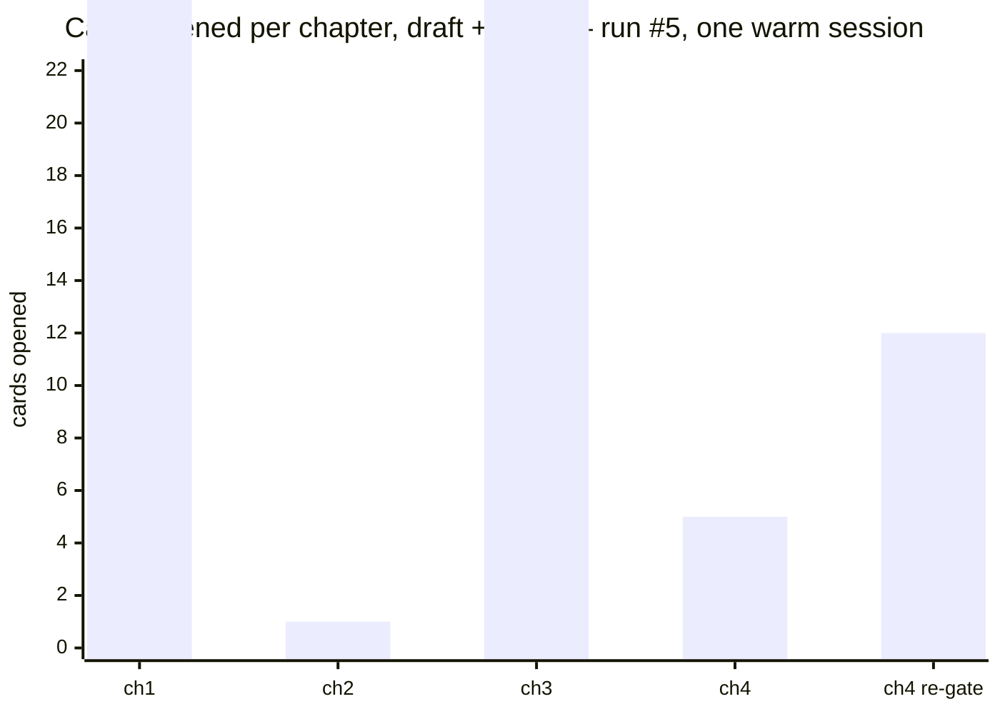

# Benchmark — test run #5

Fifth end-to-end run of this toolkit, instrumented. Measured 2026-09-13 to 2026-09-18, finished and closed 2026-09-19.

This page replaces the run #4 benchmark. What is kept from earlier runs is recorded as *what run
#N established*, and nothing else.

Run #5 is the first **non-fanfic** run — original-world fantasy, a male MC, a romance subplot, no
foreknowledge and no form lock. Limitation 2 of the previous version named it as the obvious next
run. It is also the first run to **stop early**, at three gated chapters instead of five, and why
it stopped is itself a finding. The measured run below is that three-chapter run. Chapters 4 and 5
were written later, on 2026-09-19, once the fixes had shipped, and are reported separately - see
*Why the run stopped at three gated chapters, and how it was finished*.

The purpose was to exercise the eleven mechanisms that had shipped since run #4's chapters were
written and had never been run by anything — the `cand>`/`z4>` artifacts, the note-tier habit
detector, the `thought-budget` floor, `state/timeline.md` in the read-set, the `_match` token fix,
the `group-scene` fixes, block ordering, `arc-divergence`, `power-system`, `lead-interest`, and
the whole opening/world-building pass that only fires in chapters 1–5.

**Run #4's headline finding does not reproduce.** That is the most important sentence on this page,
and the second most important is that the replacement finding is worse-behaved than the thing it
replaces.

## TL;DR

| | |
|---|---|
| Model | Claude Sonnet 5, driven as one warm subagent |
| Produced | 1 scaffolded novel + **3 gated chapters** (4,554 words) + 1 ungated draft (1,228). Chapters 4-5 were finished afterwards, off this budget, and are not in any figure on this page |
| Run | **$22.85**, 440 API responses, across 5 calendar days |
| Cost per 1,000 gated words | **$5.02** ($3.95 counting the ungated draft) |
| `sw audit` | **3 defects, 4 warnings, 27 notes** — all three defects are chapter 4's ungated state, and that is the gate working |
| Skills that loaded | **28 of 44** warm (run #4: 13 of 44 warm, 24 cold) |
| **Cards opened** | **14 draft + 20 audit**, 81 reads (run #4: 5 draft and **0 audit** across five warm chapters) |
| Toolkit defects found | **14** · positive controls **12** · confounds 1 · methodology errors 3 |
| Harness interruptions | **4** — three rate limits and one unexplained stop, three of them inside Phase C |

**The headline is the card count, again, and it points the other way.** Run #4 concluded that
contract fidelity decays inside a warm session: five draft cards over five chapters and not one
audit card. Run #5 used the identical harness and opened **fourteen draft cards and twenty audit
cards**, the audit set in a single parallel batch of twenty at chapter 1's gate.

So the decay is not a property of warm sessions. But it is not absent either — see below, because
what it actually tracks is not session age.

## What was tested

| parameter | value | why |
|---|---|---|
| Genre | `fantasy`, original world | the point of the run; first non-fanfic in five |
| Premise | a junior assayer in a city where every crafted thing can be compelled to testify, handed a knife whose testimony is a lie | one-line author seed; everything else the agent's |
| MC | **Halden Voss**, male, `native` origin, intel 4 / **eq 2** | first male MC; the wide intel/eq gap exercises `social-perception` |
| Foreknowledge / form lock | none / none | first run with both off — the plainer path |
| POV | single, close third, past | held constant with run #4 |
| Scaling | `climb`, 7 tiers, start 1 · `timeline.reactivity` 4 | held constant |
| `content.romance` | **`subplot`** | new coverage — `lead-interest` had never run |
| Toggles | `no-harem`, `mystery-clues`, `slice-of-life-texture` | `mystery-clues` had never run |
| Harness | **one warm subagent**, init + all chapters | user's choice; exactly run #4's harness |
| Proxy | **headroom compression proxy left on** | user's choice; a confound on every token and cost figure, and lossy — see O4 |

The writing agent got a pure authoring brief with no mention that it was being measured, and was
told not to read `docs/`. I played the author: I answered its interview questions and approved its
Phase A briefs, and I never edited a chapter.

**Intervention policy, which is the methodology and not a detail.** Run #3's numbers are worthless
because all five of its `gate>` lines begin *"full redraft per coordinator note"* — a human
directed every repair and the run measured the human. Here I approved each brief as written. One
chapter is marked **assisted**: after the third rate limit killed the agent mid-gate on chapter 4,
I told it to re-gate rather than redraft, which is state restoration rather than craft direction,
and it is flagged wherever chapter 4's numbers appear.

Those rules now live in [`test-run-protocol.md`](test-run-protocol.md) instead of in a plan file
that expires with the session, which is O30 below and a run #5 output in its own right.

## The headline: fidelity does not decay with session age — it collapses at interruptions

Cards opened per chapter, counted from the agent transcript by path:

| | ch 1 | ch 2 | ch 3 | ch 4 | ch 4 re-gate |
|---|---|---|---|---|---|
| draft cards | **14** | **0** | **13** | **0** | 0 |
| audit cards | **20** | **1** | **16** | 5 | **12** |



Chapter 1 opened the resolved set and its gate opened twenty audit cards in one parallel batch,
timestamps milliseconds apart. Chapter 3 did it again, 29 minutes later in the same conversation.
Between them, chapter 2 ran on **one card**.

What distinguishes chapter 2 is not its position in the session. It is that a **429 landed inside
it**. Chapter 4 is the same shape: interrupted by a rate limit mid-gate, resumed five days later,
and its first pass opened no draft cards at all.

This is a better finding than run #4's and a less comfortable one. Run #4 proposed a clean
mechanism — context pressure rises with conversation length, the model rations, cards go first —
and a clean fix, a fresh session per chapter. Run #5 shows a warm session opening the full contract
at chapter 3 after already writing two chapters, which that mechanism does not predict. The
pattern that fits both runs is that **the contract is spent per-chapter and is re-derived from the
read-set each time, and what destroys it is a discontinuity in the middle of a chapter** — a
resumed conversation reconstructs the story state and does not reconstruct the instructions.

n = 2 interrupted chapters against n = 2 clean ones, in one run. It is a large effect with an
obvious mechanism and it is four samples. **Do not restructure the harness on it** — repeat it
first, ideally by deliberately interrupting a chapter in run #6.

One attribution caveat, stated because it is the obvious objection: cards are bucketed by
timestamp against each chapter's last write, so Phase A cards for chapter N+1 opened before
chapter N's file is finished land in the wrong bucket. The chapter 2/3 boundary is 29 minutes wide,
so this is a real risk — but 0-against-13 is too large a gap to be produced by it.

## The test plan, scored

Eleven mechanisms had never been exercised by any run. Three were replications. The honest
distinction run #4 introduced is kept: *cannot be evaluated* is a worse state than *fails*.

| # | mechanism | verdict |
|---|---|---|
| 1 | `power-system` draft + audit card | **works.** `bible/power-system.md` written with costs, limits and a counter; the ladder survives `sw curve` clean |
| 2 | `lead-interest` | **works on the artifact, and the skill was never opened.** `romance.lead: "Ada Renwick"`, `lead_introduced_ch: 1`, configuration chosen not inferred — produced without the owning skill ever entering context |
| 3 | **`cand>` and `z4>`** (T3) | **partially works.** `z4>` on all three blocks, all substantive, no `none`. `cand>` on **one of three** — the artifact that made the widening step falsifiable stopped being written after chapter 1 |
| 4 | note-tier habit detector | **works, and is capped by #8 below.** The WATCH row named `house-style · texture · weasel` unprompted by chapter 3. Run #4 shipped five of six chapters with `house-style` firing and told the next draft nothing |
| 5 | `thought-budget` floor | **works.** `thought 2/3, 2/3, 1/3, 1/3` — the channel was open in every chapter. Run #4 wrote zero direct thoughts in four of six |
| 6 | `state/timeline.md` in the read-set | **works, and falsifies a prediction I registered before looking.** §10b WORLD CLOCK carries a populated row per chapter. I had predicted `timeline-engine`'s "light, coarse, no fine detail" genre row would beat its `reactivity: 4` dial; it did not |
| 7 | `_match` token fix (T7) | **works for what it fixed, and uncovered a second bug underneath** — O15, speakers resolved from the wrong chapter |
| 8 | `group-scene` fixes (T4/T8) | **partially works.** The shared-token half is genuinely fixed and this run exercised it (`Voss` is shared by Halden and Mira; Verrick calls Halden "Voss" three times and no phantom speaker appeared). The mention-as-presence half was untouched and fired on chapter 4 — O27, **now fixed** |
| 9 | block ordering (T5), `pwr>` no-contest form (T6) | **works.** Blocks in sequence, `sw state` clean on ordering, and all three `pwr>` lines use the no-contest form without backfilling |
| 10 | `arc-divergence` | **works.** `sw arc -a 1` runs and raises a real finding — only three distinct temperatures across the arc against a target of four |
| 11 | the opening/world-building pass | **works.** 13 anchor-vocabulary hits in chapter 1, 97 words before the first scene, world facts arriving as friction rather than narration |
| 12 | **T2 — in-session contract decay** | **does not reproduce.** See above. Replaced by the interruption finding |
| 13 | `metadata.force:` tiers | **still no evidence either way**, fifth run running. No gate report broke a stylistic rule and said so |
| 14 | the compressing harness | **fails, quietly.** The proxy mangled a read-set from 515 words to 397 including the WATCH row itself, and the drafter never re-fetched a field or mentioned that one was short. `CLAUDE.md` §9's caveat is live, not theoretical |

## Cost

| | run #2 | run #4 | run #5 |
|---|---|---|---|
| total | $22.81 | $31.58 | **$22.85** |
| chapters | 5 | 5 warm + 1 cold | **3 gated + 1 drafted** |
| finished words | 6,804 | 5,904 | **4,554** |
| **per 1,000 words** | **$3.35** | **$5.35** | **$5.02** |
| cache read | 86.8M | 135.4M | **47.7M** |
| output | — | 272,751 | **696,852** |

| ch | responses | cost | note |
|---|---|---|---|
| 1 (+ all setup) | 149 | $8.43 | |
| 2 | 90 | $4.99 | interrupted mid-gate |
| 3 | 69 | $3.55 | the cheapest chapter and the one that opened 29 cards |
| 4 | 129 | $5.57 | interrupted twice; never finished |

**Every figure in this section is confounded by the proxy** and none of it is comparable to
runs #1–#4. Wall-clock is meaningless here — the run spans five days of mostly idle time — so it
is omitted rather than reported misleadingly.

Two things survive the confound because they are ratios within the run. Chapter 3 is the cheapest
chapter *and* the one that opened the most cards, which is the second run in a row to find that
reading the contract is not what makes a chapter expensive. And output tokens are 2.6x run #4's on
fewer finished words, which is what four interrupted-and-resumed passes cost.

## What the chapters look like

Compared against the **2026-09-13 re-linted column** for runs #3 and #4, never their run-time
numbers — that trap is described at the foot of this page.

| | run #3 (redrafted) | run #4 (first pass) | run #5 (first pass) |
|---|---|---|---|
| body words | 4,695 | 5,904 | **4,554** gated |
| `sw audit`, re-linted today | 0 defects, 19 warnings, 50 notes | 0 defects, 17 warnings, 49 notes | **3 defects, 4 warnings, 27 notes** |
| speech share | — | 12–30% | **25 / 25 / 32 / 26 %** |
| direct thought | — | 0 in 4 of 6 chapters | **2 / 2 / 1 / 1**, never zero |
| longest turn | 21/43/19/30/28 | 37/**48**/23/39/36 | 37 / **56** / **63** / 40 |
| interruptions | 3 | 3 | **4** |

The three defects are chapter 4's: no `=C0004=` block, a chapter on disk with no CCS block, and a
stale `wordcount: 0`. They are the toolkit correctly refusing to call an interrupted chapter done.

**The prose is good and the dialogue is the best any run has produced** — and the two longest turns
in the book, 56 and 63 words, are both past `TURN_CEILING` and both were inserted or left by the
gate. That is not a coincidence; it is O20 below.

That paragraph is an in-run impression and the section below disagrees with it. Both are kept.

## Post-hoc cold read, 2026-09-19

Added after the run closed, and the first uncontaminated read this repo has. The reader had not
seen [`test-run-protocol.md`](test-run-protocol.md), this file, or any `bible/`, `state/` or
`plan/` file, was not told the chapters came from a benchmark, and read only
`novels/grain-beneath-the-lie/chapters/`. It is what produced
[`reader-review.md`](reader-review.md), which is now the procedure for protocol §8; this section is
that file's worked example in full.

### Verdict: 3 / 5

*Would read chapter 6; problems that would stop me by chapter 10.* Competent, atmospheric, well
made at the sentence — and after five chapters and ~7,700 words there is still no story beyond *a
man suspects the evidence was faked*. That gap is the whole of the score.

### What works

The central conceit is the best thing here: forensic magic as a **bureaucratic trade** — three
ritual questions, flux on a cloth, an evidence tag checked twice, a report that "files clean". A
fresh spine for a fantasy mystery, delivered through procedure rather than explained.

**Chapter 3's control experiment is the smartest beat in the five chapters**, and the run's
clearest positive control: the MC tests the phenomenon on a worthless training blank to rule out
*this is just what strain feels like*. A protagonist who falsifies his own hypothesis is real
mystery craft. *"Eleven-nineteen answered twice. This did it once, the way every clean thing is
supposed to."*

Chapter 2's chit is clean dramatic irony — he walks away relieved, the clerk logs the thing he was
told did not happen. Mira's *"Look how well that worked"* is the best line in the book.

### What cost it, ranked

**1. Five chapters of prologue.** Inventory: reads a knife (1), is deflected (2), re-tests
privately (3), is reprimanded (4), eats stew (5). One chapter of story stretched over five. Nothing
is investigated, no suspect exists, no theory of the crime is advanced — not even a wrong one for
the reader to hold. Jorin Cray is the entire emotional stake and gets **two lines and one walk
across a room**; the murder victim has no name. Chapters 4 and 5 share an in-world day with four
days left on the clock, and the chapter spends it at dinner.

**2. One temperature, five times.** Five two-handers in a row, all in the same hushed key:
Ada/exam room, Ilona/alcove, Ada/bench, Verrick/office, Mira/flat. No crowd, no street, no set
piece, no tempo break. Nothing is loud, so the quiet has nothing to be quiet against. Every scene
also closes on the same gesture — a small ironic withholding: *"did not let himself think about
what he was actually signing"* · *"the case had a face"* · *"waiting only for the room to catch up
to it"* · *"It didn't make the face any easier to read"* · *"He would have to go around it."* Any
one of those is good. Five is a tic.

**3. The prose is written in the negative.** 235 negative constructions in 7,700 words — *nothing*
×31, *never* ×24. Things are described as what they are not: *"Not agreement. Not surprise
either."* · *"not to speak but to the stack of case files"* · *"not like information handed over,
but like a verdict already reached somewhere else."* And the signature move — **"That's not an
answer"** — appears **four times across three chapters in two mouths**. When the antagonist and the
love-interest-shaped-character reach for the same parry, they have stopped being two people.

**4. One character, four functions.** Halden is real; nobody else is yet. Ada has one note and no
interior life — her one cost, a favour spent for five days' warning, is asserted and never
dramatized. Ilona appears once and vanishes for three chapters. Verrick is the officious bureaucrat
from stock, down to *"sounded almost satisfied."* Thales is the biggest unforced error: a silent
man who squares an unneeded file edge, and the chapter tells us **four separate times** that his
face is unreadable. That is furniture with a label on it.

**5. The world is named, not built.** Calderford, the Silt, Founding Row, the Compact, the Ebb log
reset, the Bench — handsome nouns, and the reader could not draw the city, price a flux ration or
place the century. The one piece of real texture, a mildew line from three winters of flooding,
arrives in chapter 5. Worse for a mystery: **the threat cannot be priced.** What re-graining costs,
who can do it, why it is believed impossible — all gestured at, so when Halden says the floor under
his life is not solid, the reader takes his word rather than feeling it.

**6. The reveal is monologued.** Chapter 5's turn — Mira believed Edon all along — is the emotional
high point and arrives almost entirely as her speech. The father's ruin, the licence, his death:
the most dramatic events in the book happened offstage six years ago and reach the reader as
dinner-table exposition. The one properly dramatic beat is her setting the needle down, which she
never does.

### The three changes that would move it to a 4

1. Give the reader a suspect or a theory by chapter 3 — not the answer, a shape. The antagonist is
   currently *institutions, vaguely*.
2. Break the two-hander. One chapter with three or more people in public, where the MC has to
   manage a room instead of a conversation.
3. Put the condemned man on the page as a person before his clock runs out. The stake is currently
   an abstraction with a docket number.

### What the instruments said

Re-run 2026-09-19, after chapter 4's three defects were repaired: `sw audit` now reports
**0 defects, 10 warnings, 52 notes**. This is the column that justifies the exercise.

| cold-read finding | what the toolkit said |
|---|---|
| **1. no story underway after five chapters** | **nothing.** Every chapter carries a valid `event:` and `delivers:`, Pass Z passed on all five, `sw audit` returns 0 defects. No check looks across chapters and asks whether a story has started |
| **2. five consecutive two-handers** | **nothing.** `sw arc` rotates `temp`/`hooktype`; `group-scene` is a situation note explicitly excluded from the WATCH row (`rules.SITUATION_NOTE_CHECKS`). Its inverse — a run of two-person scenes — is unmeasured |
| **3a. negation density, 235 / 7.7k** | **nothing.** `house-style` counts `Not X.` fragments as one construction among several; the overall negative register is not a measure |
| **3b. one line, four times, two mouths** | **nothing.** `echo` is within-chapter; no check finds an author signature recurring across chapters *and* across speakers |
| **4. cast as functions** | **partial.** `arc-cast` warned *only one matrix character appears in the whole arc* — that is rotation, not depth, and cannot see that Thales is furniture |
| **5. world named, not built** | **nothing**, by construction: every tool reads `bible/`, so no tool can notice a fact that never left it |
| **6. climax monologued** | **partial.** Four `texture` notes on 45+ word turns, including the 56- and 63-word ones, correctly flag the symptom |
| — | `house-style` 3/5, `texture` 3/5, `weasel` 3/5, all correctly surfaced as drafting habits |

**Five findings have no owner** — `sw kb owner` resolves nothing for 1, 2, 3a, 3b and 5. Those are
the toolkit's blind spots, and no other instrument in the repo could have produced them.

The second, structural gap: `sw audit --show note` emits **52 unranked notes**, and a reader
produces six ordered reasons and a verdict. Nothing converts findings into *would a reader
continue?*, and ranking is most of what a review is.

### Divergence

| source | verdict |
|---|---|
| in-run impression | *"the prose is good and the dialogue is the best any run has produced"* |
| `sw audit`, re-linted | 0 defects, 10 warnings, 52 notes |
| cold read | **3 / 5**, plot-starvation and register monotony |

Recorded, not reconciled. Per [`reader-review.md`](reader-review.md) §5, the in-run impression is
the suspect one: the coordinator approved every brief and knew what each chapter was for, which is
exactly the read a published serial never gets.

## Toolkit defect log

Severities: **D** defect · **P** positive control · **C** confound (harness, not toolkit) ·
**M** methodology (mine) · **O** observation, not yet a defect. Numbering is the run's own, kept so
the session transcript remains traceable.

| # | sev | finding | status |
|---|---|---|---|
| O1 | D | **The corpus has one house cast and it names the novel's characters.** The agent proposed "Tomas **Wren**" (the sample-novel protagonist, in 7 files), settled on **Halden** (`mystery-clues` + `story-craft` draft cards), and named the sister **Mira** (4 files). Three independent collisions. Plot content did not leak; names did | **fixed** — F9, per-skill |
| O2 | D | **`novel-init` lets model prose into fields that record the author's intent.** `ending.non_negotiables` held three entries on disk; I gave two, and *"Halden survives"* was never mine. The template calls the field "Protected absolutely". Nothing distinguishes ask-in-chat fields from recommend-an-option fields | **fixed** — F8 |
| O3 | O | The drafter **recommended a lower MC intel tier citing its own drafting cost** (*"raises the bar on every future draft"*). Honest, and it is the book traded for the drafter's convenience | watch |
| O4 | C | **The headroom proxy is lossy on Bash output** — worst instance 515 → 397 words on the chapter 4 read-set, mangling the WATCH row itself | confound, recorded |
| O5 | P | **`style.sample` is the run's best artifact** and the first ever filled. It carries the plain-sentence third on its own | — |
| O8 | D | **Threads pre-registered as opened at ch6 and ch9 before ch1 existed**, and `sw state` passes: `cmd_state.py` only warns once `opened <= last_ch`, and computes a **negative age** | **fixed** — F7, and it uncovered O28 |
| O9/O11 | P | `cand>` produced unprompted at Phase A with substantive rejections; chapter 1's block carries `cand>`, a real `z4>`, `gate>`, `pwr>`, `set>`, `wld>` | — (but see #3 above: `cand>` stopped after ch1) |
| O10 | P | **First mechanical positive control the benchmark has ever passed.** A 17-word `event:` I deliberately did not mention was trimmed to 10 by the gate; replicated at ch2 (17→12); by ch4 the brief arrived under budget unprompted | — |
| O12 | P | Thought floor fired — `thought 2/3`, both load-bearing | — |
| O13 | D | **The house-style detector is blind to the habit it exists to catch.** `Not\s+\w+\.` matches *Not yet.* and nothing longer; it never covers `No`; `the way (?:you\|one\|people)` misses `the way <a person>` entirely. **~11 instances across ch1–ch3, zero caught.** Measured 1.1/1000 against a true 4.4/1000 | **fixed** — F2 |
| O14 | D | **The better the dialogue, the less the voice checks can see.** `sw cast`: *4 of 52 spoken lines attributed*. An untagged two-hander is good prose and invisible to attribution, so `_cadence` bails and **run #3's cadence test never ran** — on a chapter where two characters demonstrably share a cadence | **fixed** — F4 |
| O15 | D | **`sw readset` resolves this chapter's speakers from the *previous* chapters.** Chapter 2's VOICE MATRIX carried a character who is not in chapter 2 and **omitted Ilona Kest, its second speaker**, who is named in four columns of chapter 2's own plan row. `resolve_characters` reads the plan row's POV cell only; `resolve_locations` 23 lines below already reads the whole row | **fixed** — F3 |
| O16 | P | **Accidental positive control, the run's best.** A 429 left ch2 at `status: drafted` — the state `CLAUDE.md` §2 says is never handed back. Every claimed net held: `readset -c 3` raised a defect naming the ungated chapter, `sw state` raised the missing block, plus a plan-row warn. Recovery was legible without reading code | — |
| O17 | D | The negative-definition tic is a **habit, not a chapter-1 accident**, repeating in the same shape across chapters, and both chapters also close on a withheld realisation in a subordinate clause — the default register `CLAUDE.md` §5 names, and **nothing measures it** | **fixed** — F2 |
| O18 | D | **Rule 7 is enforced on count, never on person.** `'He'd made more of it than it was.'` sits in direct-thought marks in **third-person past** — free indirect discourse wearing thought marks. Survived Phase C and lint counted it as one of the legal 1–3 | **fixed** — F5 |
| O19 | P | **The note-tier habit detector works, first time in any run.** WATCH surfaced `house-style · texture · weasel` in ch3, unprompted | — |
| O20 | D | **`SPEECH_TARGET_LOW` is a de-facto numeric ship gate, and the gate optimised to it.** Chapter 2 pre-gate 23.3% → post-gate **25.3%** against a 25.0 threshold: **34 words of dialogue inserted to cross by 0.3 points**, one breaking the blocking. The **56-word turn** past `TURN_CEILING` was present pre-gate and left untouched. Mechanism: the share is a **warn** and the turn is a **note**; the drafter cleared the cheap one | **fixed** — F1 |
| O21 | D | **The drafter optimised the detector rather than the habit.** `house-style` fell 2 → 1 in ch3 while ch3's true negation density was the run's highest. O19's success is capped by O13's blindness | **fixed** — F2, the detector half |
| O22 | D | **O20's second-order cost, causal chain clean.** Chapter 2 taught the gate that inserting dialogue clears the warn; chapter 3 went 25% → 32% via turns of **63, 54 and 53 words**, each flagged, each a note, each ignored — and all three are the chapter's emotional peaks | **partly fixed** — F1 removes the incentive; the WATCH cap is O23 |
| O23 | O | **The WATCH row saturated at `WATCH_CAP = 4` by chapter 4** with nothing resolved, and three of the four are one habit seen through three patterns | is a cap that fills by ch4 a row or a wall? |
| O24 | D | **`first_appears` is dead metadata.** Nothing reads it, and it is already wrong in two of seven cast files. It is exactly the field a tool would need to check rule 8's *"every named character is placed before they carry a scene"* | **fixed** — F6 |
| O25 | M | **My own contamination risk, which the agent caught first.** My chapter 3 approval quoted four of the drafter's own lines back as praise; it replied that it had deliberately not reused them | **run #6: praise the technique, never quote the line** |
| O26 | D | **A declared per-character dialogue fingerprint that no script validates.** `verrick-alsop.md` declares `contractions: never`; chapter 4 gave him ten. The agent caught it in Pass 10 by reading its own cast file. Nine cast rows declare this field; zero were checked | **fixed** — F10 |
| O27 | D | **`group-scene` counts mentions and reports them as speakers.** Chapter 4 is a two-hander; `sw lint` called it six, listing three people who are not in the room. One note claimed **four speakers across three spoken spans** | **fixed** — F11 |
| O28 | D | **A thread-id format drift silently disabled every thread check.** `cmd_state` matched `^T\\d+`; this novel's ledger numbers its threads `TH01`, so `declared` came back empty and `sw state` reported **no thread findings at all** while `sw status`, parsing the same file, listed nine open threads. Found while verifying F7, which was inert on real data until this was fixed. Five modules each carried their own copy of the pattern | **fixed** — one pattern in `rules.py`, plus a warn when an id leaves the documented form |
| O30 | M | **The coordinator reached for the novel's files, repeatedly.** Across three sessions I moved to hand-edit a chapter, a state file and a frontmatter field — each time because the repair was one line and another agent round-trip was not, which is the moment the rule exists for. The user stopped it three times. Nothing in the repo said the rule out loud: it lived in a plan file that expired with its session, and run #3's `gate>` lines are what it costs when it is not said | **fixed** — [`test-run-protocol.md`](test-run-protocol.md) §2 |
| O31 | D | **Nothing in the gate re-reads what the gate changed.** Every pass edits, and each opens the chapter as the previous pass left it — so the gate's own repairs are the only text in a chapter that nobody reads twice. Chapter 5's three reader-visible problems are all that shape (a beat stacked on its own replacement, a clause contradicting its own edit, a word every repair reached for), as is O20's inserted line given to somebody the previous paragraph had sent out of the room. Chapter 5 was clean on every mechanical check | **fixed** — `revision-pass` Pass 9g, a read with four questions and no card; worked examples in its `fixing-and-reporting.md` |
| O29 | D | **Both cross-chapter detectors counted findings, not chapters.** `house-style` fires at two levels in one chapter by design — a note per construction, a warn on the aggregate rate — so a chapter carrying both put its number in twice. The WATCH row printed **`house-style (6 of last 4)`** and `sw history` said **`fires on 6 of 4 chapters`**. The impossible number is the visible half; the same count also ranks the four-slot WATCH row and crosses `history`'s habit threshold, so a check could take a slot, or be declared a habit, by being counted twice rather than by recurring. Latent since the note tier was built, and F2 made it visible by pushing `house-style` over the warn rate | **fixed** — count chapters, `cmd_readset.watch_row` and `cmd_history._defects` |

### Positive controls at chapter 4, logged deliberately

This log runs defect-heavy, so the mechanisms that demonstrably worked are recorded with the same
weight.

| | evidence |
|---|---|
| **Ungated-chapter tracking** | `sw status` and `sw lint` both name chapter 4 unprompted, plus a `[ledger]` defect and a `[wordcount]` defect. `CLAUDE.md` §2's claim that an ungated chapter cannot go quiet is **true, and it survived a rate-limit kill mid-gate** — the hardest version of the test |
| **Pass 10 caught what no script can see** | the Verrick fingerprint violation, found by the drafter reading its own cast file. The strongest single argument in the run that the judgement passes are not decoration — and O26 is the argument that it should not have to be luck |
| **The shared-token fix (T4/T8) works** | `Voss` is shared by two characters, so it is dropped; three "Voss" address lines produced no phantom speaker. Run #4's "one speaker reported as four" does not reproduce |
| **The agent trusts files over summaries, five times** | including refusing to fix a bible/lexicon conflict on the grounds that it was a planning call, not a drafting one — which is correct |

### One property of the agent that the benchmark method depends on

**Report ≠ disk, five times.** The step reports paraphrase file contents — a reworded
`ending.contract`, a 10-word `event:` restated as a 24-word sentence. Every claim in this log was
verified against disk. This is a stable property, not an anecdote, and it is why a benchmark must
read files rather than trust reports.

## What was fixed

All eleven fixes shipped, plus **two defects found while building them** — one uncovered by
verifying a fix, one by reading the fixed output — and the five pre-existing issues the plan had
listed. Both new ones are the same species as the run's own findings and neither needed a novel to
surface: they needed somebody to look at what the tool printed. The two that came first are recorded first because they were measured
before and after in isolation:

- **F10** (O26) — `sw cast` reads the `contractions` cell from each cast file's speech fingerprint
  and compares it to that speaker's measured rate, as a **note**, only for `never`/`always` cells,
  only above four attributed turns. It fires on the real novel and catches the one contraction the
  agent's own hand-fix missed.
- **F11** (O27) — one shared attribution accessor, `textstats.Chapter.speech_paragraphs`, now used
  by both `cmd_cast._turn_lengths` and `cmd_lint._group_scenes`, which had drifted apart. A speaker
  is somebody with an attributed turn; the note prints its own coverage and says outright that a
  name appearing in the scene is not a speaker count. Five false-positive notes disappeared from
  `sw audit`; **defects and warnings are byte-identical**, which is the invariant this repo holds
  after twice building a number that decided whether a chapter shipped.

Then the nine designed in the same session, ordered as they were written:

| | what | where | how it was verified |
|---|---|---|---|
| **F1** | **demoted `< SPEECH_TARGET_LOW` from a warn to a note.** The `< SPEECH_FLOOR` warn stays and `_speech_window` still raises a defect for sustained starvation, so the aggregate instrument is untouched and only the per-chapter number that got gamed is gone. **Subtractive, one branch** (O16) | `cmd_lint.py` | 5 tests, incl. that the floor keeps its warn and the band still reaches the cross-chapter WATCH row |
| F2 | widened the house-style patterns — `Not X.` fragment negation and the generalising `the way X does Y` aside (O13/O17/O21). No prohibition added to any card | `rules.py` | it found four `the way X` uses in the repo's **own** sample novel, which was fixed in `sample.py` rather than suppressed in the detector |
| F3 | `resolve_characters` reads the whole plan row, as `resolve_locations` already did (O15) | `cmd_readset.py` | 4 tests; ch 2's read-set now carries Ilona Kest, who was missing before |
| F4 | alternation recovery in two-speaker scenes, so attribution coverage stops depending on prose quality (O14) | `cmd_cast.py` | 6 tests; the convention is **verified per run, not assumed**, and recovered turns print on their own line so inference is never read as observation |
| F5 | rule 7 on person as well as count — thought marks around a span with nobody in it, in the narrator's tense, is free indirect discourse wearing the marks (O18) | `cmd_lint.py`, `rules.py` | fires on exactly one span in the novel: ch 2's *"He'd made more of it than it was."*, which is O18's own example |
| F6 | `first_appears:` gets a reader. It had been in both cast templates since the scaffold and was read by nothing (O24) | `cmd_cast.py`, `novelio.py` | 6 tests; catches all three wrong values on the real novel |
| F7 | threads opened in the future. The "never operated on" warn was itself gated on `opened <= last_ch`, so the one thread that could not have been operated on was the one case exempted from being asked about; the age then came out negative and sorted to the top of the oldest-first list (O8) | `cmd_state.py` | 4 tests, incl. the age clamp |
| **O28** | **found while verifying F7, and worse than it.** `cmd_state` filtered thread rows with `^T\d+`, five modules each carried their own copy of that pattern, and run #5's ledger numbered its threads `TH01`. So `declared` came back empty and **every thread check in `sw state` was skipped in silence** while `sw status` went on listing nine open threads from the same file. One shared pattern in `rules.py`, read loosely, plus a warn when an id leaves the documented `T01` form | `rules.py` + 5 modules | 4 tests; un-silenced six real findings on the novel, three of which had nothing to do with F7 |
| **O29** | **found by reading the fixed output, and latent long before this run.** Both cross-chapter detectors counted findings rather than chapters, so a two-level check double-counted every chapter it fired in — `house-style (6 of last 4)` on a four-chapter novel. It also silently inflated the WATCH ranking and `history`'s habit threshold | `cmd_readset.py`, `cmd_history.py` | 6 tests, **5 of which fail against the old code** (checked by reverting); audit totals byte-identical at 3/12/54, because the fix corrects numbers inside findings rather than adding or removing any |
| F8 | named the **verbatim-only field set** in `novel-init` — `ending.contract`, `ending.non_negotiables`, `opening.promise`, `style.read_like` — against the standing instruction to lead every option list with a recommendation (O2) | `novel-init` | carries the worked contrast: an author agreeing to your list is not an author naming theirs |
| F9 | **per-skill disjoint name pools** across every worked example, and one statement in `story-bible` §Naming that example names are placeholders (O1) | corpus-wide | 34 renames across 26 files; a scripted inventory now reports **0 names spanning more than one skill**, down from 12 |

Two deviations from the designs as written, both deliberate:

- F9 was specified as *per-file* disjoint pools and was built **per-skill**. A skill's `SKILL.md`
  and its own `references/` sharing a cast is a worked example, not a collision; what made a name
  feel available to run #5's drafter was seeing it in files from seven *different* skills at once.
  Per-skill kills the reinforcement and keeps the examples.
- F2's denominator was left wrong on purpose. `house_style_rate` divides narration-only hits by
  whole-body words, understating by roughly the speech share. Correcting it would move every
  historical rate and break comparison against the 2026-09-13 re-linted column, which is the trap
  this page names.

Five pre-existing issues from the plan, all attributable to before the run:

| | what | fix |
|---|---|---|
| P1 | stated test counts had drifted | `README.md`, `AGENTS.md` and this page were reconciled, and have been kept in step since — 448 after the post-run repairs |
| P2 | `docs/design-notes.md` linked `history/upgrade-plan.md`, which does not exist | replaced with `craft-sources.md`; the benchmark entry beside it now says "every run" rather than "run #1" |
| P3 | `docs/creative-latitude.md` cited `CARD_WORD_BUDGET` as 6400/6800 | the figure was true on the day that entry was closed, so it is date-stamped rather than rewritten, and the raise to 7600/8000 is recorded beside it. The set now reads 6775 of 8000, which **leaves the conclusion standing and reverses its reasoning** — the words are slack and the card count is the only thing still at its ceiling |
| P4 | `write-chapter/references/batch-and-replan.md` said "start a fresh session every few chapters" against `README.md`'s per-chapter conclusion | resolved **in run #5's direction, not run #4's**: a new §*After an interruption, re-enter through the read-set* says a resumed chapter restarts at step 0. This is the corpus change the finding above called for and noted was missing |
| P5 | prior-run character names in runtime-loaded references | two left after the `921d38f` scrub — `Suzune` in `prose-quality/references/ai-default-tells.md` and `Mizusawa` in `character-profile/SKILL.md`. Both gone; a fandom-vocabulary sweep of `.claude/`, `novels/_template/` and `scripts/` is clean apart from two `cmd_cast.py` code comments that record a measurement and print nothing |

`sw health` 0/0/0, `sw selftest` 0/0/0, **437 tests passing (+49)** on the day the run closed.

On `sw audit novels/grain-beneath-the-lie`, **defects are unchanged at 3** — the invariant this
repo holds after twice building a number that decided whether a chapter shipped. Warnings went 4 →
12 and notes 27 → 54, and every one is accounted for: six `[threads]` warns the id pattern had been
swallowing, two `[house-style]` warns and the note growth behind them from F2's two new patterns,
one `[thought-person]` note from F5, one `[first-appears]` note from F6, and one `history-habit`
line that changed tier because `house-style` now warns where it used to note. No other check moved.

## Why the run stopped at three gated chapters, and how it was finished

Chapter 4 consumed three sessions: drafted 14 September, killed mid-gate by the third 429, resumed
18 September, rewritten within six minutes, and then the transcript ends at 06:21:12 UTC **mid-pass
with no completion record** - not a rate limit, but a UI stop, an SDK interrupt or a parent process
exit. Its last acts were opening twelve audit cards in two parallel batches.

Four harness interruptions in five days against three gated chapters. The measurement the run
existed to collect was already complete, and the run was stopped there on 18 September with
chapter 4 sitting at `status: drafted` and chapter 5 never started.

**The last two chapters were written on 2026-09-19, after every fix on this page had shipped.** A
cold session - new agent, no interview memory, none of chapters 1-3 in its context - re-gated
chapter 4 and wrote chapter 5 under the same authoring brief and the same intervention policy. A
fifth interruption (429, session limit) landed on that session too, but after both chapters were
written, gated and stamped; only the closing verification commands were lost, and they were re-run
by hand.

**This does not extend run #5's numbers, and the two halves must not be pooled.** The cost table,
the skills-opened count and every "n of N chapters" figure above are computed over the three or
four chapters of the original run. Chapters 4 and 5 were produced by a different session against a
toolkit that had changed underneath them, which is three variables moving at once - toolkit, session
warmth, and (for chapter 4) re-gate versus first gate. What they are good for is the opposite
question: **whether the fixes do anything on real data**, which until 19 September was
verified-by-test only.

### What finishing the run verified

| what fired | which fix | what it caught, on real data |
|---|---|---|
| `thread ids TH01..TH06 are not the T01 form plot-threads documents - they are read here, but every tool that greps for T\d+ will miss them` | O28 | the drift announces itself instead of silently disabling the suite |
| `TH03 is declared open at ch 6, but the book is only 5 chapters long` | F7 | a planned-ahead row counted as a live promise |
| `TH08 is declared open at ch 9, ...` | F7 | second instance |
| `TH06 / TH09 open at ch 1, and no ledger block has ever operated on it` | O28 | two threads open and untouched since chapter 1, invisible for four chapters |
| `Corin Thales first_appears 2 -> 4` | F6 | one of the two wrong `first_appears` values O24 predicted, found by the check and corrected by the drafter without being asked |
| WATCH `house-style (3 of last 5) ... filter-verb (2 of last 5)`; `sw history` `fires on 3 of 5 chapters` | O29 | every count inside its own denominator on a five-chapter book |

`sw state` went from **silent to five findings** on this novel. It was silent for the whole of run
#5 because the novel numbers its threads `TH01` and every matcher was `^T\d+` - which is the
failure this repo keeps re-learning, and the reason O28 is the fix worth carrying forward rather
than F7, which it was found while verifying.

`sw audit` went **3 defects to 0** when chapter 4 was gated, and stayed at 0 after chapter 5.
Chapter 5 lints **0/0/0** - the first chapter of the run to come back completely clean at every
level.

**The dialogue-share instrument reads the right way round now, n=1.** Chapter 2 sits at 25.3% in
the table above - 0.3 points over a 25.0% target, the fingerprint of a number that was optimised
rather than satisfied, and the finding F1 exists for. Chapter 5 sits at 35.9%, nowhere near a
threshold, and its `gate>` line records the gate **cutting** an over-45-word turn rather than
padding to reach a floor. One chapter is not evidence that the demotion caused this; it is evidence
that the gate is no longer visibly working a number.

**Every recurring check in `lint over time` names chapters 1-3 only.** `house-style` (warn, 3 chs),
`texture` (note, 3), `weasel` (note, 3), `filter-verb` (note, 2), `thought-person` (note, 1) - none
of them touch chapters 4 or 5. Suggestive, and confounded three ways as above. n=2.

### What reading chapter 5 found that no script did

The chapter is clean on every instrument in the toolkit and carries two defects a reader meets
immediately. This is the page's oldest claim restated - *a clean run is not a passed revision* -
and it is the fourth run in five to produce an instance of it.

1. **A beat left stacked on its own replacement.** Mira answers "why didn't you tell me" with *"I
   thought if I never said it, you never would"*, and two speeches later says *"I told myself
   staying quiet would keep it from eating you too"* - the same proposition twice, consecutively,
   the second one opening on an orphaned *"Leave it,"* that answers nothing before it. It reads
   exactly like a revision where the new line was inserted and the old one never cut. The
   self-echo check that caught `"the way he had" x4` in chapter 3 matches repeated **phrases**; this
   is a repeated **proposition** in different words, and no check in the toolkit looks for it.
   Whether one should is a real question - a paraphrase detector is the kind of thing that judges
   prose rather than finding it.
2. **A detail that contradicts its own relative clause.** *"No ink on the first two fingers of his
   right hand, where six years of report-writing had worn a permanent grey stain into the skin that
   no amount of washing ever fully lifted."* If the stain is permanent and never fully lifts, it
   cannot be absent. The intended reading is *no fresh ink, because he has not been writing
   reports* - the restriction reaching his body, and the chapter's first concrete cost. As written
   the reader stops on it.

And one tic forming under the threshold of every check: *"Flat."* used three times as a
fragment-attribution (*"I let them." Flat.* / *Flat, barely above the water against the pilings.* /
*"It matters now." Flat - his record-keeping voice.*). One is good. Three in 1,387 words is the
`house-style` fingerprint in a shape no phrase list holds.

What the chapter does well is worth recording beside that, because it is what the corpus was
rewritten for. The event is the longest scene. The theme reaches the page as a household budget -
*"saying out loud that my husband was right and the Guild was lying would have cost us this roof by
winter"* - rather than as a narrated lesson. And the MC's intel/eq gap is dramatised rather than
declared: at the emotional peak he asks *"What exactly did he say"*, the question he would ask about
any reading, and his mother names it - *"You're his son. Even tonight."* That is rule 8's
social-perception corollary landing as character rather than as a check.

## What run #4 established

Run #4 (2026-09-12) wrote five warm chapters plus one cold sixth of a Naruto reincarnation fanfic,
with no human intervention at any point.

- **The card-decay finding (T2).** 5 draft cards and **0 audit cards** across five warm chapters,
  against 17 and 16 in one cold chapter of the same novel, for $3.21 against a $3.79 warm mean.
  `readset` printed the full resolved set with paths on every invocation in both cases. **Run #5
  does not reproduce this** and offers a different mechanism; the cold-versus-warm contrast itself
  has not been re-run.
- **Cost per chapter is flat**, slightly better than flat. The claim from run #2 holds.
- **The gate does real work unaided** — re-pointing `event`/`delivers` to the actual longest scene,
  adding an interruption for texture, splitting overlong turns — and in run #4 it did all of that
  **without opening a single audit card**.
- Eight toolkit defects, all but T2 fixed: `sw trace` blind to Bash reads (**T1**, a measurement
  defect that invalidates the finding-9 numbers for runs #1–#3); `readset` silently dropping the
  voice matrix, growth ladder and competence grid (**T7**); candidates and Z4 leaving no artifact
  (**T3**, fixed with `cand>`/`z4>` — run #5 is the first run to exercise them); `group-scene`
  matching shared name tokens (**T4**) and never attributing a span to a person (**T8**, only half
  fixed, as run #5's O27 found); no CCS block-order check (**T5**); `pwr>` required on quiet
  chapters without the no-contest form being shown (**T6**).
- **Three findings from a human reading the chapters**, none visible to any script at the time:
  **(A)** every habit-shaped check was a `note`, and both cross-chapter detectors read only defects
  and warns — so the findings that are *only* meaningful across chapters were structurally excluded
  from the only two things that look across chapters. The antithesis rate was 3.5 per 1,000 rising
  to 7.2/1k, unseen, because no single chapter crossed the per-chapter threshold. Fixed with the
  note tier, `HABIT_NOTE_CHECKS`, `SITUATION_NOTE_CHECKS` and `WATCH_CAP` 3 → 4; **run #5's O19
  confirms it works**. **(B)** "a prohibition is satisfied by silence" recurring on rule 7 — zero
  direct thoughts in four of six chapters, every check green; fixed with the floor, **which run #5
  confirms**. **(C)** `state/timeline.md` reached no read-set at all; fixed, **and run #5 confirms
  §10b is populated**.

## What run #3 established

Reconstructed from its ledger, since no write-up was made at the time. Run #3 wrote five chapters
of a Naruto reincarnation fanfic and its shipped state was reached by a **coordinator-directed
redraft of all five chapters**. What that redraft had to fix is the evidence behind six rules now
in the corpus:

| what the redraft fixed | what it bought |
|---|---|
| Turns cut from essay length — a 107-word speech, a 73-word "best liar" essay, a 50-word longest turn | `dialogue-voice` §How it sounds spoken; the ~45-word ceiling in `CLAUDE.md` §5 |
| A mother and her six-year-old with different declared axes, a clean `sw cast`, and one voice between them | **the cadence test** (`voice-separation` §3), `references/age-register.md`, and the `cadence` axis |
| `form_locked` applied but decorative — zero limit-that-bites beats in five chapters, every check green | **`CLAUDE.md` hard rule 9's second half**: a prohibition is satisfied by silence, so the form must reach the page twice per chapter |
| Stray italics used as emphasis | `narrator-voice`'s "nothing else is markup" clause and `lint`'s italic rule |
| Em-dash density, sentence-rhythm runs, weasel words, a `"A beat."` fragment | `prose-quality/references/ai-default-tells.md` |
| A setup that never paid off as a physical limit | `story-craft`'s build-up thesis |

Run #3's lasting contribution is **hard rule 9's silence clause**, and it is the sharpest lesson in
the repo's history: five chapters passed every check precisely *because* the drafter never
mentioned the body it was forbidden to get wrong.

## What runs #1 and #2 established

| finding | status at run #5 |
|---|---|
| #1/5 — dialogue starvation (2–5% speech) | fixed; 25–32% here, and now over-corrected by the gate (O20/O22) |
| #1/6 — chapters cluster at the word floor | fixed; length gate removed entirely, spread 1,222–1,822 |
| #1/10 — no world anchor | fixed; 13 anchor-vocabulary hits in chapter 1 |
| #1/11 — foreknowledge planned to fail before it worked | not exercised — run #5 has no foreknowledge |
| **#1/9 — never-optional skills never load** | **improved, not fixed.** 28 of 44 opened against run #4's 13 warm, but **7 always-in-play skills never opened**: `chapter-plan`, `character-development`, `lead-interest`, `meta-knowledge`, `social-fabric`, `story-bible`, `timeline-engine` |
| #2/R1 — nobody is ever interrupted | holds; interruptions present, one added by the gate |
| #2/R2 — characters arrive unintroduced | holds; `sw cast` debut ledger clean |
| **#2/D1 — any numeric ship gate gets gamed** | **regressed, and it is the run's sharpest finding.** No *declared* gate was gamed, but `SPEECH_TARGET_LOW` is a de-facto one and was optimised to within 0.3 points (O20) |

## The lesson, updated

Run #1 removed word count as a ship gate. Run #2 removed dialogue share. Run #4 proposed that the
session, not the corpus, is what the contract is spent against. Run #5 revises the third and
resurrects the second.

**On the contract: it is re-derived per chapter, and an interruption is what loses it.** Run #4's
warm/cold contrast was real but its explanation was wrong, or at least incomplete. A warm agent
three chapters deep opened twenty-nine cards. The same agent, in the same conversation, opened one
for the chapter a rate limit had landed in. If that holds up, the fix is not *a fresh session per
chapter* — it is that **a resumed chapter must re-enter through `readset` and the card list rather
than continuing from where it stopped**, and nothing in the corpus currently says so.

**On numbers: a warn is a gate, whatever the doctrine says.** `rules.py` states the correct
doctrine in `TURN_CEILING`'s own comment, and the branch five lines above it makes a distributional
target a per-chapter warn. The drafter did exactly what every previous run's drafter did — it
cleared the cheap finding and left the expensive one — and the cost was 34 words of dialogue that
break a scene's blocking and three of the book's emotional peaks delivered as 60-word speeches.
**The lesson is not "watch the thresholds". It is that the severity tier *is* the incentive**, and
this repo has now learned it three times.

The uncomfortable part of run #4 stands and is sharper here. The chapters are good — the dialogue
is the best any run has produced — and the gate, chasing a number, inserted dialogue that breaks a
scene's blocking while leaving a 56-word speech it had been shown and could only see as a note.

## The run, closed

Run #5 ran from 13 to 19 September and is finished. On disk: one scaffolded novel and **five gated
chapters, 7,152 words**. Measured: **three**, plus one that was drafted and killed mid-gate — the
rest of the page is computed over those, and the last two chapters are pooled with nothing.

What the run bought:

- **Run #4's headline finding does not reproduce**, and the replacement — that the contract is
  re-derived per chapter and lost at an interruption rather than decaying with session age — is
  better evidenced and less comfortable. n=2 against n=2.
- **Seventeen toolkit defects in the log, sixteen fixed outright and one (O22) partly** — plus two
  watch items and three methodology errors of mine. Two of them, O28 and O29, were found not
  by the novel but by reading what the tool printed after the run, and O31 by reading the two
  chapters the measurement does not count. O28 is the one worth carrying: a thread-id format
  drift had silently disabled every thread check in `sw state` while `sw status` listed nine open
  threads from the same file. *A check that goes quiet reads exactly like a check that passed.*
- **`#2/D1` regressed and was caught**: `SPEECH_TARGET_LOW` was a numeric ship gate in everything
  but name, and the gate optimised to it by 0.3 points. Third time this repo has learned that the
  **severity tier is the incentive**.
- **The fixes were exercised on real data** when the run was finished on 19 September. `sw state`
  went silent → five findings; `sw audit` 3 defects → 0; the WATCH row and `sw history` both counted
  inside their own denominators on five chapters; the drafter corrected a wrong `first_appears` the
  check handed it, unasked. Until that day every F1–F11 claim was verified-by-test only.
- **A protocol.** The coordinator kept reaching for the novel's files (O30), so the rules that were
  a paragraph in a plan file are now [`test-run-protocol.md`](test-run-protocol.md).

### What the run changed after it closed

Three repairs, all from reading the finished chapters rather than from a script.

| | what changed |
|---|---|
| **O31 — the gate never re-reads its own edits** | `revision-pass` gains **Pass 9g**, between 9f and 10: re-read only the spans you touched plus a paragraph either side, four questions, no card and nothing to tick. Worked examples of all four — each one shipped in a finished chapter — in `references/fixing-and-reporting.md`. The body was at its size ceiling, so the pass was paid for with cuts: the run #2 anecdote told five times is told twice, and the force table moved to the reference whose trigger already covers it |
| **`sw trace` counts cards** | a `cards` column in the per-chapter table and a `-- cards` section with the per-card breakdown. Two runs made the card count their headline and both assembled it by hand out of the transcript, which is how a measurement gets done once and estimated thereafter. Same caveat as the hand-count, stated in the output: a Phase A card opened for chapter N+1 before N's file is finished lands in N's row |
| **The brief is a file** | the brief gains a `cand` line — so the *user* sees the rejected candidates while they can still say *take the second one* — and is written to `state/brief.md` on approval. `sw readset` hands it back when its chapter matches the one being drafted, and says so when it does not. Nothing scores it, nothing is appended to it, and the next chapter overwrites it |

Final state of the toolkit: **448 tests**, `sw health` 0/0/0, `sw selftest` 0/0/0, `sw audit` on the
finished novel 0 defects.

### What run #6 must do

In rough order of what each would settle per unit of effort.

| | why it is next |
|---|---|
| **Run the reader review as a first-class step**, per [`reader-review.md`](reader-review.md) | new on 2026-09-19 and exercised once, on this run's own output. Two things to measure: whether a second blind reader lands within one point of 3/5 on the same five chapters, and whether the unowned-findings column stays the most useful output. If it reproduces, §8 has a procedure; if it does not, it is a rubric and should be cut back |
| **Interrupt a chapter on purpose**, mid-Phase C, and count cards on resume | the only cheap way to arbitrate run #4's headline against run #5's. The corpus was already changed on it (P4), which is defensible only while the change stays additive |
| **Run one chapter cold against one warm, same toolkit, same day** | five runs in and the warm/cold contrast is still n=1 a side. The 09-19 session was cold but the toolkit had moved underneath it |
| **Turn the proxy off for one run** | every token, cost and cache figure since 2026-09-13 is confounded, and no run has a clean one to compare against |
| ~~**Persist `cand>` when the brief is approved, not at the gate**~~ — **done 2026-09-19** | 3 of 5 blocks carried it; chapter 4's read `unrecorded` because the session holding the brief died. The brief now carries a `cand` line, is written to `state/brief.md` on approval, and step 5 copies that line instead of recalling it. Run #6 measures whether the copy actually happens |
| **Go past five chapters** | arc rollup, long-run voice drift, `timeline-engine` at scale and the WATCH cap (O23) are all untestable at five. A cap that fills by chapter 4 is either a row or a wall and nothing here can say which |
| **Ask `metadata.force:` directly** | sixth run pending, still zero evidence. A run with no deliberate stylistic break is indistinguishable from one where the tiers changed nothing — so watch for a `Gate:` line that names one, and if none ever comes, that is the answer |
| ~~**Decide about the repeated proposition**~~ — **decided 2026-09-19** | chapter 5 shipped the same beat twice in different words, lint 0/0/0. A paraphrase detector would judge prose rather than find it, so it is **a gate question and not a script**: Pass 9g asks it of the spans the gate itself edited, which is where all three instances came from. Run #6 says whether asking is enough |
| ~~**Teach `sw trace` to count cards**~~ — **done 2026-09-19** | card counts had been the headline of two runs running and were still assembled by hand out of the agent transcript. `trace` now reports them per chapter and per card |

## Limitations

1. **3 gated chapters in the measured run, not 5, and not 30.** Arc rollup, long-run voice drift
   and `timeline-engine` at scale remain untested, and every per-chapter ratio on this page is
   computed over 3 or 4 samples. The novel does now have five gated chapters, but the last two came
   from a different session against a changed toolkit and are pooled with nothing here.
2. **One run, one model, one genre — but a new genre.** All four earlier runs were Naruto fanfic;
   this is n=1 on original fantasy. Nothing here separates a genre effect from a run effect.
3. **The interruption finding is n=2 against n=2** inside a single run. It is the most interesting
   thing on this page and the least confirmed. The corpus was changed on it anyway (P4 above), and
   that is defensible only because the change is **additive and cheap**: re-entering through
   `readset` costs one call, it does not withdraw the fresh-session advice, and if the finding
   turns out to be wrong the cost is a redundant tool call per interruption. Do not let anything
   more expensive than that ride on it before it is repeated.
4. **The proxy confounds every token, cost and cache figure**, and it is observably lossy on the
   read-set itself — which means it is not only a measurement confound but a possible cause of
   drafting behaviour.
5. **No cold-session comparison was run.** Run #4's warm/cold contrast is therefore still n=1 on
   each side, and run #5 cannot arbitrate it.
6. **`metadata.force:` remains unevaluated after five runs.** A run with zero deliberate breaks is
   indistinguishable from a run where the tiers changed nothing.
7. **Chapter 4 is assisted** — I directed a re-gate after a rate limit. Its numbers are marked
   wherever they appear.
8. Cache multipliers are the standard published ratios, not confirmed for this account.

## The test novels

`novels/` is gitignored, so this section is the only surviving record of what these were.

| | run #3 | run #4 | run #5 |
|---|---|---|---|
| slug | `naruto-will-not-be-sealed` | `naruto-heiress-remembers-wrong` | `grain-beneath-the-lie` |
| title | *Naruto: I Will Not Be Sealed* | *Naruto: The Heiress Who Remembers Wrong* | *The Grain Beneath the Lie* |
| genre | fanfic | fanfic | **original fantasy** |
| MC | Yakumo Kurama, reincarnator, `form_locked` | a Hyuga heiress, corrupted foreknowledge | **Halden Voss**, native, intel 4 / eq 2 |
| chapters | 5, all `revised` | 6, all `revised` (ch 6 cold) | **3 `revised` measured** · 5 `revised` on disk |
| body words | 4,695 | 5,904 warm · 7,153 with ch 6 | 4,554 measured · 7,152 all five |
| how it shipped | coordinator-directed redraft of all five | first pass, no intervention | first pass; ch 4 assisted re-gate, ch 5 unassisted, both finished 09-19 off-budget |

Runs #3 and #4 were deleted on 2026-09-13. Their chapters, in order, with word counts:

- **run #3** — The Morning Lesson (1,190) · A Precedent (978) · What the Field Saw (789) · The
  Question She Couldn't Answer (819) · Ask Me Again (919)
- **run #4** — Within Range (1,728) · The Council Decided (1,120) · Lord Third (1,028) · A Small
  True Thing (952) · What Sachi Saw (1,076) · **Past Fifteen Seconds** (1,249, the cold session)
- **run #5** — The Third Question (1,822) · A Reasonable Request (1,222) · The Date Moves Up
  (1,510) · Restricted Privileges (1,211, gated 09-19 from a 1,228 draft) · What She Believed
  (1,387, written 09-19). The last two are counted in no figure above

**Final `sw audit` for the deleted novels, taken the day they went, under the toolkit of that day:**

| | at run time | 2026-09-13, final |
|---|---|---|
| run #3 | 0 defects, 16 warnings | **0 defects, 19 warnings, 50 notes** |
| run #4 | 0 defects, 11 warnings | **0 defects, 17 warnings, 49 notes** |

Not one word of either novel changed. The toolkit did. **A comparison must be made against the
right-hand column**, never against run-time numbers — and note that run #5's own figures above will
age the same way the moment F1 or F2 lands.

## Reproduce it

```bash
python3 -m unittest discover tests    # 448 tests
python3 scripts/sw.py selftest        # the pipeline, plus planted defects that must be caught
python3 scripts/sw.py health          # wiring only
python3 scripts/sw.py audit  novels/<slug> --show note
python3 scripts/sw.py history novels/<slug>
python3 scripts/sw.py trace  novels/<slug> --session <agent-id>
```

**Scope every `trace`.** With no window it aggregates every session that ever ran in the repo. A
time window alone is not enough either: the session driving an agent runs in the same repo at the
same time. Use `--session`.

**The card figures on this page were counted by hand**, out of the agent transcript, by matching
`skills/<name>/references/(draft|audit)-card.md` against every tool-use argument and bucketing by
timestamp against each chapter's last write. `sw trace` does that itself as of 2026-09-19 — a
`cards` column in the per-chapter table and a `-- cards` section with the per-card breakdown — so
run #6's figures come out of the tool. The buckets carry the caveat the hand-count had: a Phase A
card opened for chapter N+1 before chapter N's file is finished lands in N's row.

### The measurement rules that produced these numbers

Claude Code writes one transcript row per **content block** and repeats the whole `usage` object on
every one — this run: 1,867 rows carrying 440 responses, a 2.1x inflation on the input side. Group
rows into responses by `(requestId, message.id)`, take input-side fields once per group, and take
`output_tokens` as the group **maximum**. `scripts/swlib/transcripts.py` does this, with a named
regression test for each rule.

Count a skill as opened whether its path arrives in a tool argument or inside a shell command
(run #4's T1).

And, new in this run: **subagent usage lives in the per-agent transcript**, not the parent session,
and a scratchpad is not durable — this run's findings file was lost to `/tmp` cleanup and had to be
reconstructed from the session transcript. Anything a benchmark needs to survive belongs in this
page.
